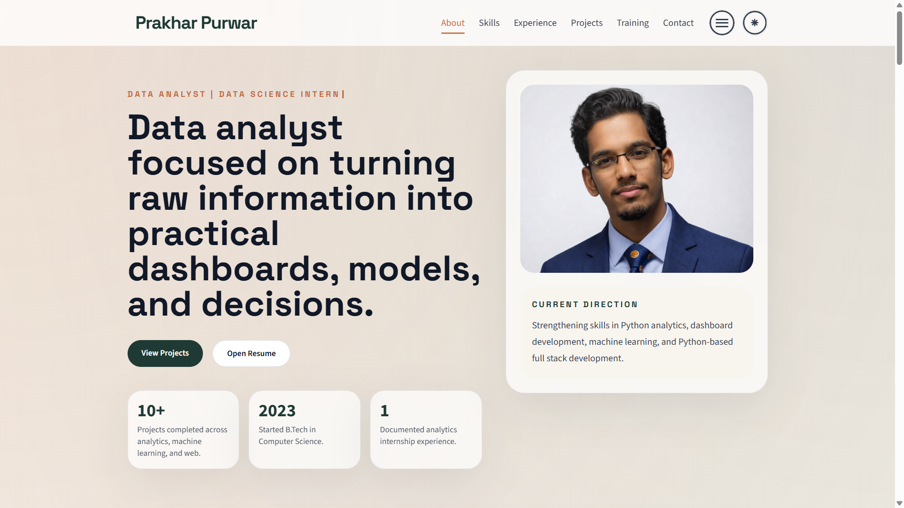

# Prakhar Purwar Portfolio

Personal portfolio website for showcasing my work in data analytics, machine learning, and full stack development.

[Live Website](https://prakharpurwar12.github.io/My-Website/) | [Resume](assets/docs/Resume.pdf) | [LinkedIn](https://www.linkedin.com/in/prakharpurwar/) | [GitHub](https://github.com/PrakharPurwar12)

## Preview



## Overview

This portfolio is designed as a recruiter-friendly and project-focused personal website. It presents my background, selected work, internship experience, technical skills, certifications, and academic journey in a clean single-page layout.

The site is built to communicate three things quickly:

- what I work on
- what I have built
- how I am preparing for analytics and software roles

## Highlights

- Clean responsive portfolio with light and dark mode support
- Project showcase with live demo and GitHub links
- Dedicated sections for internship, training, achievements, certificates, and education
- Resume access directly from the portfolio
- Certificate lightbox preview for credential images
- Custom styling and interaction layers using vanilla JavaScript and CSS

## Featured Content

### Internship

- Deloitte Data Analytics Job Simulation

### Selected Projects

- Sales Visualization Dashboard
- Socio-Economic Analysis of Indian Households
- Bargain Hunter Bot
- Car Price Prediction Model

### Skills Snapshot

- Languages: Python, C, C++, Java, JavaScript, SQL, HTML, CSS
- Data and ML: Pandas, NumPy, Matplotlib, Seaborn, Plotly, TensorFlow, PyTorch, scikit-learn
- Frameworks: Flask, FastAPI, Django, Django REST Framework, Streamlit
- Tools: Git, GitHub, Power BI, Jupyter Notebook, Postman, MySQL, PostgreSQL

## Built With

- HTML5
- Tailwind CSS via CDN
- Custom CSS
- Vanilla JavaScript

## Sections Included

- Hero
- About
- Skills
- Internship
- Projects
- Training
- Achievements
- Extracurricular
- Certificates
- Education
- Contact

## Project Structure

```text
Portfolio/
|-- index.html
|-- css/
|   `-- style.css
|-- js/
|   |-- script.js
|   `-- cursor-trail.js
|-- assets/
|   |-- docs/
|   |   `-- Resume.pdf
|   `-- images/
|       |-- deloitte-certificate.png
|       |-- dp.png
|       |-- favicon.svg
|       |-- FreeCodeCamp.png
|       |-- google-certificate.png
|       |-- hooded-coder.svg
|       |-- image.png
|       |-- lpu-ml-certificate.png
|       |-- portfolio-landing-preview.png
|       |-- project-bargain-hunter.svg
|       |-- project-car-price.svg
|       |-- project-household-analysis.svg
|       |-- project-sales-dashboard.svg
|       |-- square_image.png
|       `-- toc.png
|-- .gitignore
`-- README.md
```

## Run Locally

This is a static website, so no build process is required.

1. Clone the repository.
2. Open `index.html` in a browser.
3. For a better workflow, run it with a live server extension from your editor.

## Why This Portfolio

This portfolio is structured to be simple for recruiters to scan while still showing technical depth through:

- impact-focused project summaries
- direct access to demos and source code
- clearly separated learning, training, and certification sections
- a polished UI with responsive behavior and theme support

## Contact

- Email: `purwarprakhar00@gmail.com`
- LinkedIn: `https://www.linkedin.com/in/prakharpurwar/`
- GitHub: `https://github.com/PrakharPurwar12`
